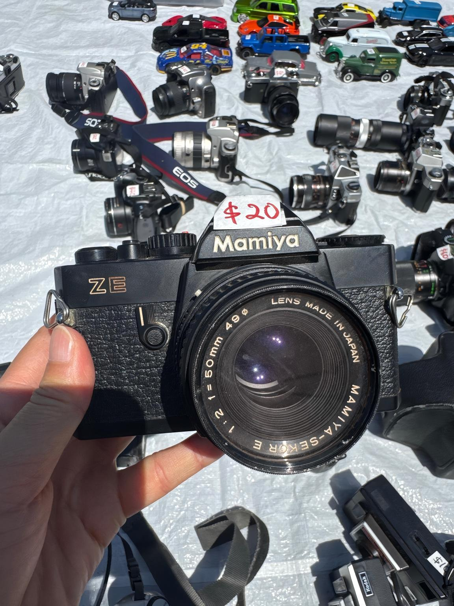

# 📷 My First Look at Old Digital Things

# 第一次认真看旧数字产品

Today I saw many old cameras, music tapes, small digital devices, and other things people used before.

今天我看到了很多旧相机、磁带、小型数字设备，还有以前人们经常使用的东西。

I liked the cameras most. Some looked very old, but some were still expensive. I learned that an old object is not always valuable. The model, condition, design, and whether it still works are all important.

我最喜欢的是相机。有些看起来很旧，但价格还是很高。我发现一个东西旧，不代表它一定有价值。型号、保存状态、设计，还有能不能正常使用都很重要。

I want to keep learning about early digital products and find out why some ordinary objects become future collectibles.

我想继续认识早期数字产品，也想知道为什么一些以前很普通的东西，后来会变成收藏品。

🎮 **Today’s thought / 今天的想法**

Old technology can tell us how people lived before.

旧科技也能告诉我们，以前的人是怎样生活的。
